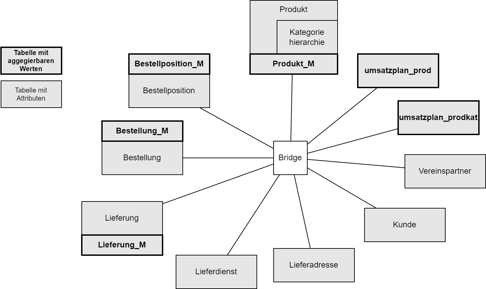

# Unified Star Schema Abbildung
---
In diesem Verzeichnis  wird beispielhaft eine Abbildung der Willibald Daten als Unified Star Schema bereitgestellt.

Das Unifed Star Schema ist eine Data Mart Modellierungsmethode, die gegenüber einem Star Schema 
eine höhere Flexibilität/Kombinationsmöglichket der Datenabfrage ermöglichst und gleichzeitig das Risiko von
Fehlkombinationen mit Datenverlusten oder Datenduplizierungen durch die Abfrage klein hält.

## Grundprinzipien der USS
Für das bessere Verständnis hier die wesentlichen Grundprinzipien. Die vollständige Beschreibung des Ansatzes und der 
darin berücksichtigten Facetten der Datenrealität sind im Buch "The Unified Star Schema" von Bill Immon und Francesco Puppini
2020 Technic Publication Verlag (ISBN 97816346228877, ISBN ePub 97816346228891) beschrieben.

### Bridge + Tables Struktur
- Das Unified Star Schema besteht aus beliebig vielen Datentabellen und einer zentralen Bridgetabelle
- Die **Datentabellen** müssen eine Spalte mit einem Primärschlüssel enthalten
- Die weiteren Spaltern in den Datentabellen können Attribute oder Messwerte sein
- Es gibt keinerlei Beziehungen zwischen Datentabellen. Alle Beziehungen werden durch eine entsprechende Zeile in der
Bridgetabelle ausgedrückt
- Die **Bridgetabelle** enthält als erste Spalte die "Stage" Spalte, die anzeigt aus welcher Quelle oder Geschäftsobjekt
der Inhalt der jeweiligen Bridgezeile stammt
- Die weiteren Spalten enthalten den Schlüssel zu einer der Datentabellen (in der Regel also 1 Spalte pro Datentabelle)
- In der Bridgetabelle gibt es für jede Stage einen kompletten Satz an Datenzeilen, wobei nur Spalten zu 
Datentabellen gefüllt sind, deren Kombination aus dieser Stage abgelesen werden kann

### Datenabruf
Um Daten aus dem Modell abzurufen, wird die Bridgetabelle nur mit den Datentabellen gejoined, in denen die Attribute und Werte
für die jeweilige Fragestellung liegen.

Das BI Werkzeug muss dazu folgendes Unterstützen:

- Daten aus unterschiedlichen Zeilen mit gleichen Attributwerten "ineinenanderschieben"

## USS für Willibald

## Fallbeispiele im Willibald Modell für das USS Verständnis
Für die Fallbeispiele ist es hilfreich, das Willibald Modell in der ODM Notation zu modellieren. Um alle 
USS spezifischen Aspekte zu berühren, wurden einigen Willibald Tabellen weitere Spalten mit aggregierbaren Werten 
hinzugefügt. Diese Tabellen sind im Diagamm mit einem * gekennzeichnet.

### "Loss of Data"
Loss of Data beschreibt den Umstand, dass bei einem inner Join, nur die Elemente im Ergebnis bleiben, die in beiden Tabellen
den Joinkriterien entsprechen.

Im Willibald Datenbestand ist dies der Fall bei:
- Produkte, die von keiner Bestellposition angesprochen werden
- Lieferadressen, die von keine Bestellung angesprochen werden
- Lieferdienste, die von keiner Lieferung angesprochen werden
- Kunden, für die keine Bestellung exisitert
- Bestellung, für die kein Kunde existiert 

Die USS bietet in der Bridge aufgrund ihrere Funktionsprinzips für alle Elemente einer Tabelle mindestens einen Datensatz an,
da dieser aus der Quelle selbst erzeugt wird. Beim Join der Daten mit der Bridge hängt es einzig  den "Left" Joins ab, ob diese
Datensätze in der Ergebnismenge ankommen.

### "Fan Trap" 
Die "Fan Trap" kann überall dort auftreten, wo:
- zwei oder mehr Tabellen in beziehung stehen
- diese Tabellen aggregierbaren Werte mit unterschiedlicher Granularität beinhalten

Im Willibald Datenbestand ist dies der Fall bei:
- Bestellposition und Bestellung
- Lieferung und Bestellposition
- Bestellposition und Produkt

In der USS müssen für eine korrekte Behandlung die aggregierbaren Felder von den einfachen Attributen in eine separate
Tabellen getrennt werden.

