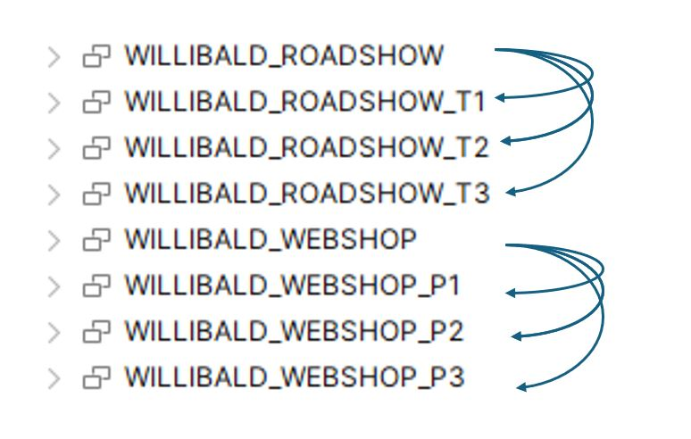

Installation and users Guide for Loaing Willibald DB
==========================================================================

## Licence and Credits

(C) Ulrich  Peschl, cimt ag

Creative Commons License [CC BY-ND 4.0](https://creativecommons.org/licenses/by-nd/4.0/)

# Introduction 
Willibald DB installation is very complex. 
Why? 
- DDLs and DML's  are coded for MS SQl Server.
- Some DDL's are missing. 
- CSV files uses german date and decimal separator format.
- several periods of data with different tables and columns has to be loaded

Goal : ANSI SQL and a python script would be very helpful for a fast installation on **Snowflake** and **PostgreSQL** DB.


# Requirements

### Willibald Database
- Target Database: The script should work for **Snowflake** and **PostgreSQL**.
- DDL compatibility: DDLs should work with PostgreSQL and Snowflake as well -> **ANSI** DDL's Creation
- Cleanup: all configed schema has to be dropped before creation and loading 
- Loading: Fast loading needed -> CSV Bulk Load
- Logging: Executed sql  has to be logged in terminal 
- Willibald sources: Existing source DDLs and CSV files should not be touched, new DDLs with postfix _ANSI.sql should be created
- Configuration: DB Connection, Schemata and file directories should be outsourced in separate config file

CSV Files:
- Reference CSV data should also be loaded, no DDL in original sources -> DDL Creation
- Some CSV files names differ to target tables names -> mapping needed
- German date format in  has to be interpreted in the correct format
- German decimal separator in CSV files must be  in the correct format
- Encoding of UTF-8-BOM has be interpreted in the right way

Data delivery periods:
- 6 schemas for the tables to be load:
  -  3 data delivery schemas for Webshop and
  -  3 data delivery schemas for Roadshow

- 2 schemas for the views pointing to the current day/period tables:
  - 1 schema for Webshop and
  - 1 schema for Roadshow
  



# Installation Guide
### Requirements
- python 3.10 or higher must be available
- please install missing python packages on demand
  - pip install psycopg2 (PostgreSQL)
  - pip install snowflake-connector-python (Snowflake)
  - pip install pandas (CSV - Load)
- A text editor (hopefully capable of JSON syntax highlitging and hierarchie folding)


### Installation Steps

1. Clone Repository

2. Copy config files from
   Willibald-Data / config_template -> Willibald-Data / config 
   
3. Add or modify values to  your environment values
   - db_snowflake_config.json: connection for Snowflake 
   - db_postgresql_config.json: connection for Postgresql 
   - folder_config.json: folders 
   - schemas_config.json: schemas 
  
# Usage Guide
   
1. Run python script
   
   - Snowflake  (Willibald-Data / Load_Willibald_Snowflake.py)
   - Postgresql (Willibald-Data / Load_Willibald_PostgreSQL.py)
  
# Appendix   
Added files and folders
```
- Willibald-Data / Load_Willibald_PostgreSQL.py
- Willibald-Data / Load_Willibald_Snowflake.py
- Willibald-Data / doc / Setup_Load_Willbald.md
- Willibald-Data / Grafik / schemas.md
- Willibald-Data / config_template / db_postgresql_config.json
- Willibald-Data / config_template / db_snowflake_config.json
- Willibald-Data / config_template / folder_config.json
- Willibald-Data / config_template / schemas_config.json
- Willibald-Data / config /
- Willibald-Data / Webshop / Testdaten Periode 1 / _Testdaten_DDL_ANSI.sql
- Willibald-Data / Webshop / Testdaten Periode 1 / _Testdaten_DDL_1_ANSI.sql
- Willibald-Data / Webshop / Testdaten Periode 1 / kategorie_DDL_ANSI.sql
- Willibald-Data / Webshop / Testdaten Periode 1 / produkt_typ_DDL_ANSI.sql
- Willibald-Data / Webshop / Testdaten Periode 1 / termintreue_DDL_ANSI.sql
- Willibald-Data / Webshop / Testdaten Periode 2 / _Testdaten_DDL_2_ANSI.sql
- Willibald-Data / Webshop / Testdaten Periode 2 / kategorie_DDL_ANSI.sql
- Willibald-Data / Webshop / Testdaten Periode 2 / termintreue_DDL_ANSI.sql
- Willibald-Data / Webshop / Testdaten Periode 3 / _Testdaten_DDL_3_ANSI.sql
- Willibald-Data / Webshop / Testdaten Periode 3 / kategorie_DDL_ANSI.sql
- Willibald-Data / Roadshow / Tag 1 / _Roadshow_DDL_1_ANSI.sql
- Willibald-Data / Roadshow / Tag 1 / _Roadshow_DDL_ANSI.sql
- Willibald-Data / Roadshow / Tag 2 / _Roadshow_DDL_2_ANSI.sql
- Willibald-Data / Roadshow / Tag 3 / _Roadshow_DDL_3_ANSI.sql
```


